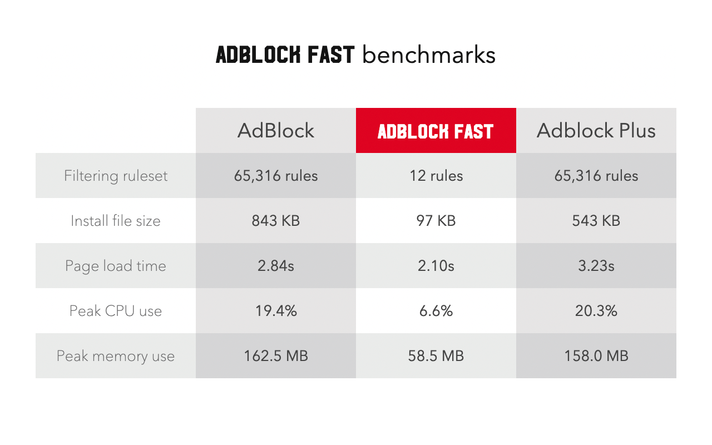
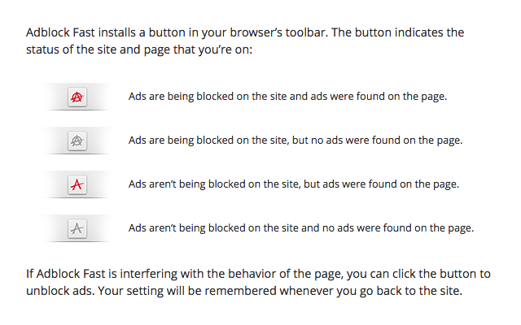
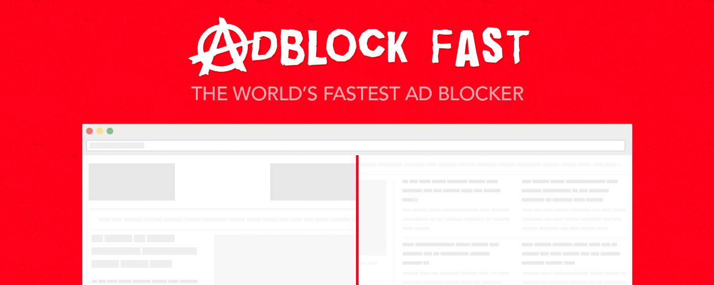

# Adblock Fast

## Product details

**Description:**

Adblock Fast is a faster, open-source ad blocker.

Just as webpages grew bloated with ads, so too have ad blockers grown bloated with little-used
filtering rules and features that sap their speed and hog your computer’s CPU, memory, and storage.
Adblock Fast runs a mere 12 optimized filtering rules to accelerate pages 8x more but consume 6x
less computing resources than other ad blockers do.

See Adblock Fast’s site for source code, benchmarks, support, and frequently asked questions.

**Category:** Tools

**Language:** English

## Graphic assets

**Store icon:**

**Promo video:** https://www.youtube.com/watch?v=zvLKGxwmGxo

**Screenshots:**

**Small tile:**

**Marquee tile:**

## Additional fields

**Official URL:** adblockfast.com

**Homepage URL:** https://adblockfast.com/

**Support URL:** https://adblockfast.com/#help

_Copyright 2015– [Rocketship](https://rocketshipapps.com/). Some rights reserved._
